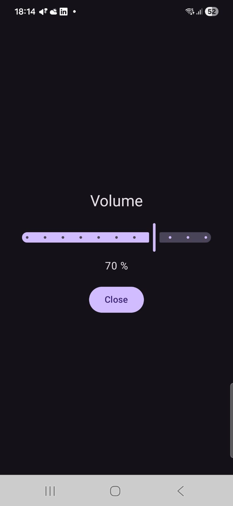

# VolumeReducer

## What does it
It reduces the overall volume of the device.

## Why does it exist
Because sometimes a volume of 1 is still too loud. And 0 means disabled. I also found some other apps, but I like it simple. 
VolumeReducer has 2 elements a slider and a close button. Thats it. 

## How
It uses the built-in equalizer and reduces the volume by reducing the bands of the equalizer to the minus range.

## Important note
VolumeReducer won't work on every device because device-specific implementations may ignore, override or disable the equalizer that is used. Beside of that, using the global option in the systems equalizer is deprecated.

## Screenshot

